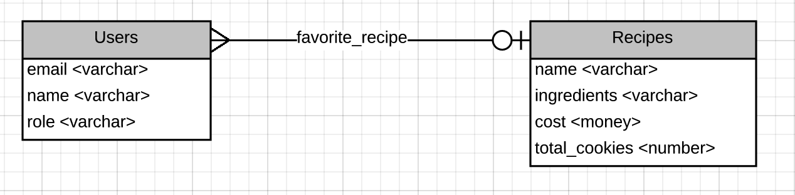

## CookieCRUD™

> Everyone grab your toques, because we're about to bake!


**In case you've forgotten, in the last week we have:**

1. worked with groups of people to organize a project where we had to generate user stories and data models,
2. worked on a large codebase, becoming used to a structured Ruby application and the set-up necessary to make it work,
3. created scripts using Ruby and Rake to automate and simplify conventional tasks for building and maintaining a web application,
4. wrapped our persistence layer in an ORM to ease the interface between our application's logic and our store,
5. worked with multiple repos, pushing and pulling changes and keeping a shifting codebase up-to-date, and
6. built out the full CRUD actions of a *user* model (in two different apps), which is often the most complex model to work on.

**That's a lot! Congratulations!**

Over this long break, we have to integrate all of these things into a straightforward application from the ground up. To do it, ***we are going to model a bakery as a web application.***

#### Let's roll (cookie dough)

Everyone should write an app with the following features. You can work alone or in groups of up to four, all on a single repo.

The ERD looks like:



##### `User` model and controller:

- As a database administrator, I can assign three roles to current users, so that they can have the appropriate permissions on the site:
    - `customer`
    - `baker`
    - `patissiere`
- As a **first-time visitor to the site**, I can become a `User` of the app, so that I can use CookieCRUD™.
  - as someone looking to become a `User`, I should only be able to sign up with the role of 'customer'
- As a **customer** user, I can **log in to the app** to order and eat some delicious cookies!
- As a **petissiere** user, I can **log in to the app** to create new recipes for cookies, or to update the menu for our customers.
- Any **user** can **edit their own info**
- Any **user** can **remove their profile from the website**...
- As a **baker** user, I can **log in to the app** so that I can bake cookies to sell.
- As a **baker** or **patissiere** user, I can see all of the **user** profiles on the app.
- As a **baker** or **patissiere** user, I can remove a **customer** user's profile from the app ("no more cookies for you!").
- As a **customer** user, I *cannot* remove another user's profile from the app.
- As a **patissiere** user, I can remove a **baker** profile from the app (fired!).
- Any **user** **can have (but does't need to have) a favorite recipe**, so that the user knows what kind of cookie he or she likes to bake or eat!

##### `Recipe` model and controller:

- As a **patissiere** user, I can **create a new `recipe`** for a cookie...
- As a **user**, I can **browse a list of all of the recipes** in all the world...
- As a **baker** user, I can **choose a recipe and go to a page where I bake cookies with that recipe**.
- As a **customer** user, I can **choose a recipe and see a the information about that recipe including the number of cookies**, in order to buy those cookies.
- As a **customer** user, when I **choose a recipe with no cookies baked for it, I see a sincere apology from CookieCRUD™**.
- As a **customer** user, I can **visit a recipe and see a picture**, so that I have a good idea of what I'm buying.
- As a **baker** or **patissiere** user, after choosing a recipe, I can **create cookies with that recipe** by the dozen...
- As a **customer**, I can **"buy" cookies in any number, and they are removed from CookieCRUD™**...

### Additional Features

If you have written the above features in to your app, you can continue to add the feature descriptions below (they are not fleshed-out user stories yet). Instead, if you wish, you can return to the DVR app and build out those features. Additionally, you can add non-CRUD features from below (bonus)...

- Make each batch (or dozen) of cookies unique, and allow a baker to craft them with one or more of the following (this will necessitate moving cookies in to their own table):
  - sprinkles
  - frosting
  - gluten-free
  - ice cream
- Allow customers to suggest specific types of cookies, or mix and match their orders for multiple batches of cookies.
- Add ingredients as a table to the app, and keep track of ingredients being used whenever the cookies are made (this one is very hard!)...

### Bonus

##### Rake

1. Write a Rake task called **bake:cookies** that iterates through the available bakers, having each one bake a dozen cookies. Make sure that the bakers cycle through the recipes equally, so that:
  - if any recipe is out of cookies, it has two batches (two dozen) cooked immediately by the first two available bakers,
  - otherwise the next recipe picked is the recipe with the fewest number of cookies,
  - if there are two (or more) recipes tied for fewest, then the baker will pick the recipe that comes first alphabetically.
1. Write a Rake task called **bake:favorite[baker_name]** that tasks a baker with the given name to bake a dozen of their favorite cookies. If they don't have a favorite, they will bake *le favori de la pâtissiere*!

##### Features

1. As a visitor to the site who hasn't signed in, I can see a nice menu page with each type of cookie, along with its cost and quantity, when I visit the site.
1. As a customer user I can create a request for cookies if I want more than exist.
  - That request is emailed to the patissieres in the DB, with a type, amount, time needed by, and the customer info.
1. As a baker user, I can be turned in to a patissiere by another patissiere.
1. As the admin, I can ensure that every morning at 4:00am the application will run the `bake:cookies` task above.
  - *Note: [You can use a library](https://github.com/javan/whenever).*

##### Authentication and Authorization

*Note: we will go over "auth" (as it is called) next week with Rails.*

1. Add passwords to all users with BCrypt.
  - [BCrypt](https://github.com/codahale/bcrypt-ruby)
  - [A pure Sinatra example](https://gist.github.com/amscotti/1384524)
  - [**An incredibly useful plugin for Sequel**](https://github.com/mlen/sequel_secure_password)
2. User Sinatra's [`before` filter](http://www.sinatrarb.com/intro.html#Filters) to authorize users' requests... For example:

```ruby
before '/recipes' do
  if request.request_method == 'POST'
    if current_user.role != 'patissiere' # uses the current_user helper from the DVR app solution
      redirect to('/recipies?warning=You+can+not+access+that+page')
    end
  end
end
```

After this, only someone who is a patissiere, can visit the route `POST /recipes`.

##### Tests

Write Capybara tests for the basic features, the bonus features above, the rake scheduler above, and the "auth" tasks above, to ensure they all work as described.
